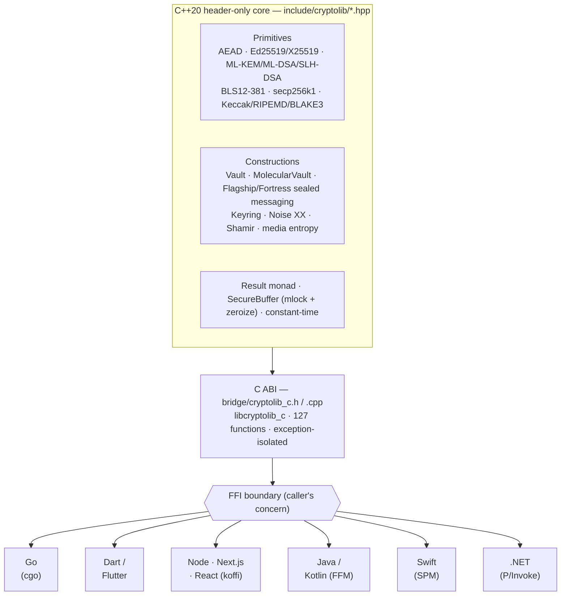
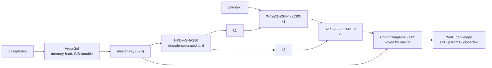

# CryptoLib

> A C++20 cryptography library covering classical, post-quantum, hybrid, and
> blockchain primitives behind a single C ABI — usable from Flutter, Go, Node,
> Next.js/React, JVM, Swift, and .NET via auto-loading language packages.

Single include on the C++ side. Language packages bundle the native binary and
load it automatically — no manual path, no manual setup. Built on vetted
upstreams (libsodium, liboqs, blst, OpenSSL libcrypto, BLAKE3, libsecp256k1) and
wrapped in misuse-resistant high-level constructions (Vault, **MolecularVault**,
Keyring, hybrid KEM/signatures, committing AEAD, Noise XX). Every binding wraps
the **same** native core, so a value sealed in one language opens byte-for-byte
in another.

```cpp
#include <cryptolib/cryptolib.hpp>
```

---

## Capabilities

| Layer | What it does | Primitives |
|---|---|---|
| **Hash / KDF** | Hashes, password hashing, HKDF, HMAC | BLAKE2b, BLAKE3, SHA-256/512, HMAC-256/512, HKDF-256, Argon2id |
| **AEAD** | Authenticated encryption | XChaCha20-Poly1305, AES-256-GCM, SecretStream |
| **AEAD (hardened)** | Key/context **committing** AEAD (closes Invisible-Salamanders / partitioning-oracle), **nonce-misuse-resistant** AEAD | UtC CommittingAead (HKDF + XChaCha20-Poly1305), AES-256-GCM-SIV (RFC 8452) |
| **Asymmetric** | Key exchange, signing, sealed/hybrid boxes | X25519, Ed25519, Box, SealedBox, HybridBox |
| **Post-quantum** | NIST FIPS 203/204/205 | ML-KEM (512/768/1024), ML-DSA (44/65/87), SLH-DSA (128/192/256, SHA2 + SHAKE) |
| **Hybrid PQC** | Classical + post-quantum, secure if EITHER survives | X25519 + ML-KEM-768 (KEM) · **X25519 + sntrup761** (NTRU-Prime KEM, a second lattice family) · Ed25519 + ML-DSA-65 (signatures) |
| **Triple hybrid** | No single cryptanalytic point of failure across three families | **TripleHybridKem** (X25519 + ML-KEM-768 + sntrup761) · **TripleSig** (Ed25519 + ML-DSA-65 + SLH-DSA, adds hash-based) |
| **Sealed messaging** | One-call authenticated PQ messaging, recipient-bound, streaming | **Flagship** (sntrup761 hybrid + hybrid sig) · **Fortress** (triple KEM + triple sig) — see below |
| **Secure channel** | Mutual auth + forward secrecy | Noise XX (`Noise_XX_25519_ChaChaPoly_SHA256`) — vector-validated byte-exact vs `noise-c` |
| **BLS12-381** | Sign / verify / **aggregate** | via blst (aggregate + aggregate-verify) |
| **BBS anonymous credentials** | Multi-message signatures with **zero-knowledge selective disclosure**, **per-verifier pseudonyms**, and **blind issuance** | BBS (BLS12-381-SHA-256, CFRG drafts) — sign/verify · ZK proof over a chosen subset · unlinkable-yet-per-context pseudonyms · issuer-blind committed attributes — see below |
| **EVM / Bitcoin** | Blockchain interop primitives | Keccak-256 (original padding), RIPEMD-160, secp256k1 ECDSA (keygen / pubkey / sign / verify / **ecrecover**, RFC6979 + low-S) via libsecp256k1 |
| **High-level** | Vault (KDF → integrity → AEAD → signature), **MolecularVault** (cascade + Argon2id + committing, PQ-composable), Keyring (envelope encryption with device + passphrase slots, rotation, anti-downgrade), Shamir M-of-N secret sharing |  |
| **Defense-in-depth** | Steganography (DCT/QIM, phase coding) and LavaRand-style media entropy — framed as novelty / defense-in-depth, not as confidentiality primitives | PPM / BMP / PNG / GIF / JPEG / WAV / FLAC / MP3 / MP4 / AVI / CRVF |

### MolecularVault — maximum-assurance layered encryption

Composition of vetted primitives (no new cryptography) that raises the
*practical* cost of decryption to this library's theoretical maximum:

```
plaintext ─XChaCha20-Poly1305─▶ ─AES-256-GCM-SIV─▶ ─CommittingAead(UtC)─▶ "MVLT" envelope
   key = Argon2id(passphrase, tunable to GiBs)  |  a 32-byte full-entropy master
```

Defends against password guessing (memory-hard Argon2id), a single-cipher break
(two independent AEAD families with independent HKDF-split keys), key/context
confusion (key-committing outer layer), and tampering (authenticated, fails
closed). Its raw-key mode composes with the hybrid X25519+ML-KEM-768 KEM for
post-quantum (harvest-now-decrypt-later) defense.

### Flagship & Fortress — state-of-the-art sealed messaging

Two assurance tiers of one construction — **encapsulate → sign-then-encrypt
inside a key-committing cascade, recipient-bound, auth-first** — exposed as a
one-call, self-usable messaging layer in every binding (an `Identity` bundles a
party's recipient-KEM + sender-signature keypairs).

| | KEM (confidentiality) | Signature (authenticity) |
|---|---|---|
| **Flagship** (default) | X25519 + sntrup761 | Ed25519 + ML-DSA-65 |
| **Fortress** (max assurance) | + ML-KEM-768 (triple) | + SLH-DSA (triple) |

Every message is hybrid-PQ confidential (secure while *any* KEM leg holds),
hybrid-PQ authentic (forgery needs breaking *all* signature legs), key-committing,
and **recipient-bound** — a decrypting recipient can't re-forward it as if you'd
sent it to someone else. Surface per binding: creating (`Identity`) · one-shot
`seal`/`open` · `StreamSealer`/`StreamOpener` for large data (per-chunk integrity
now, sender-authenticity at finalize) · `inspect`/`addressedTo` for keyless
routing. Try it: `make sealed` (Node/Go/Dart/Swift).

Composition only — no new cryptography. Library-native wire format (not a
standard); static-recipient KEM, so not forward-secret against recipient-key
compromise (layer a ratchet for live FS).

### BBS — anonymous credentials & selective disclosure

A faithful, byte-exact implementation of the CFRG BBS drafts over BLS12-381-SHA-256
(via blst), for privacy-preserving credentials — a holder proves a signed
attribute set while revealing only what a verifier needs.

| Capability | What it enables | Standard |
|---|---|---|
| **Sign / verify** | One signature over a vector of messages (attributes) | `draft-irtf-cfrg-bbs-signatures` |
| **Selective disclosure** | A zero-knowledge proof that reveals a chosen subset of attributes while proving a valid signature covers *all* of them — the core of W3C Verifiable Credentials | same |
| **Per-verifier pseudonyms** | A holder is **unlinkable across verifiers** yet presents a **stable pseudonym per context** — a verifier recognises the same holder on return visits without any cross-verifier tracking | `draft-irtf-cfrg-bbs-per-verifier-linkability-02` |
| **Blind issuance** | The holder commits to private attributes the **issuer never sees**; the issuer blind-signs over the commitment plus its own attributes | `draft-irtf-cfrg-bbs-blind-signatures-02` |
| **Canonical-scalar helper** | `hash_to_scalar(member_secret, dst)` → a stable, deterministic per-holder pseudonym seed; `random_scalar()` for fresh secrets — both guaranteed `< r` so they never silently break a proof | base draft §D.2.3 vector |

Validated **byte-exact against the drafts' official test vectors** (generators,
commitment, blind-sign, proof, and `hash_to_scalar`); the pseudonym prover-secret
paths, where the vectors withhold the secret, are round-trip validated against the
byte-exact verifier. Exposed in every BBS-carrying binding — **Go, Dart, Flutter,
Node, Swift**. Composition/standards implementation only — no new cryptography.

```
Issuer                                   Holder                          Verifier
  │                                         │                                │
  │        commitment (blinds secret attrs) │                                │
  │◀────────────────────────────────────────                                │
  │  blind-sign(commitment + issuer attrs)  │                                │
  ────────────────────────────────────────▶│  proof: reveal subset + nym    │
  │                                         ────────────────────────────────▶│
  │                                         │        verify(proof, pseudonym) │
```

---

## How it works

One header-only C++ core is exposed through a stable C ABI; every language
binding is a thin wrapper over the **same** `libcryptolib_c`. There is no
per-language wire format — only the library's format — so ciphertext, packets,
signatures and MolecularVault "MVLT" envelopes are byte-identical across
languages.



**Data flow — a MolecularVault seal** (composition of vetted primitives, each
layer authenticating, keyed independently):



> Swap `passphrase → Argon2id` for a **hybrid X25519+ML-KEM-768** shared secret
> and the same cascade becomes post-quantum. See the [recipes](#recipes--composition-in-practice).

---

## Recipes — composition in practice

The primitives compose. These **runnable** examples snap them together into
real-world flows — no new cryptography, just vetted parts wired up. The same
recipes are mirrored across five languages:

```sh
make recipes          # C++  (6 recipes, incl. Shamir threshold)
make go-recipes       # Go   (5)
make node-recipes     # Node (5)
make swift-recipes    # Swift (5)
make flutter-recipes  # Flutter/Dart (5, via flutter test)
```

| Recipe | Composition | Demonstrates |
|---|---|---|
| **File-as-key vault** | media entropy (deterministic) → master → MolecularVault | "your file is your key" — reproducible, nothing stored |
| **Post-quantum message** | hybrid X25519+ML-KEM-768 → shared secret → MolecularVault | harvest-now-decrypt-later resistance |
| **Sign-then-seal** | Ed25519+ML-DSA signature carried inside a MolecularVault | authenticity + confidentiality in one envelope |
| **Threshold vault** | MolecularVault key split 3-of-5 via Shamir | no single custodian can open — or block — the secret |
| **EVM wallet** | secp256k1 → Keccak-256 address → sign → ecrecover | Ethereum-style signing, end to end |
| **Keyring-guarded vault** | Keyring (device + passphrase) → MolecularVault master | master key never at rest in plaintext; slots revocable |
| **Sealed messaging** (`make sealed`) | Flagship / Fortress: hybrid KEM → sign-then-encrypt in a committing cascade, recipient-bound, streaming | one-call authenticated PQ messaging with an `Identity`, both tiers, Node/Go/Dart/Swift |

Source: [`example/recipes.cpp`](example/recipes.cpp) ·
[Go](bridge/bindings/go/recipes/main.go) ·
[Node](bridge/bindings/cryptolib-node/recipes.js) ·
[Swift](bridge/bindings/swift/cli/recipes.swift) ·
[Flutter](bridge/bindings/cryptolib_flutter/test/recipes_test.dart).
The same envelopes open across languages — a value sealed by the Go recipe opens
in the Swift recipe and vice-versa, because every binding wraps the same core.

---

## Production posture

| Discipline | Status |
|---|---|
| Test suite | **317 / 317 passing** (custom zero-dependency runner) |
| Memory safety | **AddressSanitizer + UBSan clean**, all suites |
| Concurrency | **ThreadSanitizer clean** (multithreaded stress test) |
| Differential fuzzing | libFuzzer harness in CI; wrapper ⟷ raw libsodium byte-equality |
| Constant-time | `ctgrind`/Valgrind probe over `secure_equal`, AEAD, KEM decaps, keyring unlock (Linux CI) |
| Known-answer tests | RFC/FIPS vectors for the underlying primitives; **byte-exact KAT for Noise XX vs the official `noise-c` vector** |
| Secrets in memory | `SecureBuffer` with `sodium_mlock`/`sodium_munlock`; zeroization audited (see threat model §8) |
| C-ABI boundary | Exception isolation, indistinguishable error returns (no oracle), bounds-checked length math |
| Language coverage | 10 bindings verified end-to-end by running, not just compiling |
| Self-contained binary | macOS desktop dylib depends only on `/usr/lib/libSystem` + `libc++` — bundled in the npm / JVM / .NET packages |
| Release pipeline | SBOM (syft) + keyless cosign signing + SLSA provenance (CI on `v*` tag) |

The full threat model — assets, AI-assisted adversary, security arguments for
the original compositions (Vault, Keyring, hybrid KEM combiner, committing
AEAD), zeroization audit — lives in [`docs/THREAT_MODEL.md`](docs/THREAT_MODEL.md).

**Pending before regulated production:** an external audit of the original
compositions, and FIPS 140-3 validation if your deployment requires it. The
primitives themselves come from vetted upstreams.

> **Standard warranty disclaimer applies.** The software is provided **as is**,
> without warranty of any kind. Cryptography is high-stakes; deployments are
> the operator's responsibility. See the LICENSE for the full disclaimer.

---

## License — MIT

This project is licensed under the [MIT License](LICENSE).

You're free to **use, modify, distribute, and build commercial products on top
of it**. The only requirement is to **preserve the copyright notice** and
credit the author. That's it.

The standard MIT warranty disclaimer applies — provided "as is", no warranty.
Cryptography is high-stakes; deployments are the operator's responsibility.

---

## Multi-language usage — step by step

The C++ library is exposed through a single C ABI (`bridge/cryptolib_c.h`),
and every supported language ships an auto-loading package that bundles the
native binary. Consumers add the dependency and call the API — no path
configuration, no manual `.so`/`.dylib` placement.

Each example below shows the **minimum to round-trip the post-quantum hybrid
KEM** (X25519 + ML-KEM-768), which exercises FFI marshaling, struct returns,
and out-error handling end-to-end.

> Replace `<org>` with the actual package coordinate when published. Until
> publication, use the local paths shown for in-repo evaluation.

### Flutter (Dart + native FFI)

1. **Add the plugin.** In your app's `pubspec.yaml`:
   ```yaml
   dependencies:
     cryptolib_flutter:
       # After publication on pub.dev: cryptolib_flutter: ^3.0.0
       # During evaluation, depend on the path:
       path: ../path/to/bridge/bindings/cryptolib_flutter
   ```
2. **Get dependencies.** `flutter pub get`.
3. **Import + call.** The loader picks `DynamicLibrary.process()` on iOS, the
   bundled `.so` on Android, and the system `.dylib` on macOS automatically.
   ```dart
   import 'package:cryptolib_flutter/cryptolib_flutter.dart';

   void main() {
     final lib = CryptoLib.load();
     lib.init();
     final kp  = lib.hybridKemKeygen();
     final (ct, ss) = lib.hybridKemEncapsulate(kp.publicKey);
     final ss2 = lib.hybridKemDecapsulate(ct, kp.secretKey);
     assert(ss.length == 32);
     // ss and ss2 are equal — both parties hold the same shared secret.
   }
   ```
4. **Build for your platform.** `flutter build apk` / `flutter build ios --simulator`.

### Node.js (npm)

1. **Install.** Once published: `npm install cryptolib`. From source:
   `cd bridge/bindings/cryptolib-node && npm install`.
2. **Use.** The loader resolves the bundled binary from
   `prebuilds/<platform>-<arch>/` automatically.
   ```js
   const crypto = require('cryptolib');
   crypto.init();
   console.log('version:', crypto.version());                              // 3.0.0
   const kp = crypto.hybridKemKeygen();
   const { ciphertext, sharedSecret } = crypto.hybridKemEncapsulate(kp.publicKey);
   const ssDec = crypto.hybridKemDecapsulate(ciphertext, kp.secretKey);
   console.log('match:', sharedSecret.equals(ssDec), 'ss bytes:', sharedSecret.length);
   ```
3. **Run.** `node your_script.js`. No `LD_LIBRARY_PATH`, no `--dlopen`.

### JVM (Java / Kotlin)

JDK 22+ (uses the Foreign Function & Memory API). The JAR embeds the native
library and extracts it at startup.

1. **Build the JAR** (from source, until Maven Central publication):
   ```bash
   cd bridge/bindings/cryptolib-jvm
   javac -d out src/cryptolib/*.java
   mkdir -p out/native && cp -R native/* out/native/
   jar cfe cryptolib-jvm.jar cryptolib.Main -C out .
   ```
2. **Add it to your project** and call:
   ```java
   try (var c = new cryptolib.CryptoLib()) {
       c.init();
       System.out.println(c.version());                                    // 3.0.0
       var kp  = c.hybridKemKeygen();
       var enc = c.hybridKemEncapsulate(kp.publicKey());
       byte[] dec = c.hybridKemDecapsulate(enc.ciphertext(), kp.secretKey());
       assert java.util.Arrays.equals(enc.sharedSecret(), dec);
   }
   ```
3. **Run.** `java --enable-native-access=ALL-UNNAMED -jar cryptolib-jvm.jar`.

### Swift (Swift Package Manager)

1. **Add the package.** In your app's `Package.swift`:
   ```swift
   dependencies: [
     .package(path: "../path/to/bridge/bindings/swift"),
     // After tagging a release with a hosted xcframework:
     // .package(url: "https://github.com/<org>/cryptolib", from: "3.0.0"),
   ],
   targets: [
     .target(name: "YourApp", dependencies: [
       .product(name: "CryptoLibC", package: "CryptoLib"),
     ]),
   ]
   ```
2. **Build.** SPM embeds the `binaryTarget` xcframework automatically — no
   `pod install`, no manual Xcode steps.
3. **Use.**
   ```swift
   import CryptoLibC
   guard cryptolib_init() == 0 else { exit(1) }
   let v = String(cString: cryptolib_version())                            // "3.0.0"
   let kp = cryptolib_hybrid_kem_keygen()
   var err: UnsafeMutablePointer<CChar>? = nil
   let enc = cryptolib_hybrid_kem_encapsulate(kp.public_key.data, kp.public_key.len, &err)
   // ... decapsulate, compare
   ```

### .NET (NuGet)

1. **Add the package** (once published on NuGet): `dotnet add package CryptoLib`.
   From source: `cd bridge/bindings/cryptolib-dotnet && dotnet pack -c Release`,
   then add the produced `.nupkg`.
2. **Use.** The runtime auto-resolves the native binary from
   `runtimes/<rid>/native/`.
   ```csharp
   using CryptoLibNet;
   CryptoLib.Init();
   Console.WriteLine(CryptoLib.Version());                                 // 3.0.0
   var (pub, sec) = CryptoLib.HybridKemKeygen();
   var (ct, ss)   = CryptoLib.HybridKemEncapsulate(pub);
   var ssDec      = CryptoLib.HybridKemDecapsulate(ct, sec);
   ```
3. **Run.** `dotnet run -c Release`.

### Go (cgo)

Go links the native code at the consumer's build time. The current binding
links against a locally-built dylib; for portable distribution, use the
vendored merged static archive (see `PUBLISHING.md`).

1. **Build the native library** (one-time): `make lib` (produces
   `build/release/libcryptolib_c.dylib`).
2. **Run the example:**
   ```bash
   cd bridge/bindings/go
   DYLD_LIBRARY_PATH=$PWD/../../../build/release go run ./showcase
   ```
3. **Use from your code:**
   ```go
   import "cryptolib_bridge/cryptolib"

   func main() {
       if err := cryptolib.Init(); err != nil { panic(err) }
       kp := cryptolib.HybridKemKeygen()
       enc, _ := cryptolib.HybridKemEncapsulate(kp.Public)
       dec, _ := cryptolib.HybridKemDecapsulate(enc.Ciphertext, kp.Secret)
       _ = enc.SharedSecret  // == dec
   }
   ```

---

## Building from source (C++ + C ABI)

```bash
# Native dependencies (macOS)
brew install cmake ninja libsodium liboqs blake3 openssl@3

# Build + run the C++ test suite (382 cases, ASan-clean)
cmake -S . -B build/test -G Ninja -DCMAKE_BUILD_TYPE=Release \
  -DCRYPTOLIB_BUILD_TESTS=ON -DCRYPTOLIB_BUILD_BRIDGE=OFF
cmake --build build/test --target cryptolib_tests
./build/test/cryptolib_tests

# Build the shared C library used by every binding
cmake -S . -B build/release -G Ninja -DCMAKE_BUILD_TYPE=Release
cmake --build build/release --target cryptolib_c

# Sealed, self-contained static archive: every dependency linked in, with a
# no-sock/no-dso libcrypto so the binary carries no socket or dlopen code.
bash scripts/build_static_archive.sh          # → build/static/libcryptolib_c.a
make audit                                     # no-ambient-authority symbol gate

# Optionally back ML-KEM/ML-DSA/SLH-DSA with OpenSSL EVP (FIPS-track) vs liboqs
cmake -S . -B build/ossl -G Ninja -DCRYPTOLIB_PQ_BACKEND_OPENSSL=ON   # see pq.hpp
```

See [`PUBLISHING.md`](PUBLISHING.md) for cross-platform packaging notes (npm,
JVM, Swift, .NET, Go), the supply-chain pipeline (cosign / SBOM / SLSA), and
the publish checklist.

---

## Documentation

- [`docs/THREAT_MODEL.md`](docs/THREAT_MODEL.md) — adversary model, security
  arguments for original constructions, zeroization audit, assurance posture
- [`docs/SELF_CONTAINMENT.md`](docs/SELF_CONTAINMENT.md) — no-ambient-authority
  audit, sealed (no-sock/no-dso) static build, dependency-substitution defense
- [`docs/ROADMAP.md`](docs/ROADMAP.md) — candidate primitives for later iterations
- [`PUBLISHING.md`](PUBLISHING.md) — per-ecosystem packaging + release pipeline
- `bridge/cryptolib_c.h` — the C ABI surface every binding marshals over

---

## Contributing

Issues and pull requests welcome. **Do not file vulnerabilities as public
issues** — email the security contact in `SECURITY.md` (or open a private
report via GitHub Security Advisories). Before submitting code, please ensure
the test suite still runs clean (`./build/test/cryptolib_tests`) and that
`scripts/verify_bindings.sh` stays green across all 10 bindings.
